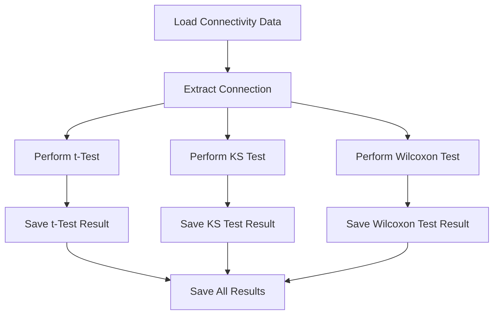

# Step 6: Statistical Significance Tests for Corticomuscular Connectivity

This step focuses on performing statistical tests to identify significant brain-to-muscle and muscle-to-brain connectivity from the connectivity matrices derived in earlier steps. The analysis involves multiple statistical tests to ensure robustness, and the results are saved for each connection.

## Table of Contents
1. [Initial Setup](#initial-setup)
2. [Parameters and Configuration](#parameters-and-configuration)
3. [Subject and Group Selection](#subject-and-group-selection)
4. [Defining Phases and Trials](#defining-phases-and-trials)
5. [Running the Statistical Analysis](#running-the-statistical-analysis)
6. [Statistical Analysis Workflow](#statistical-analysis-workflow)

---

## 1. Initial Setup

```matlab
clearvars -except subj groupName earlyFraction;
close all; clc;
```

---

## 2. Parameters and Configuration

```matlab
fs = string(filesep) + string(filesep);
fPath = string(pwd) + fs;
global timewindow;
timewindow = [-0.4, -0.1];
alpha = 0.01;
windowLengthSec = 0.4;
windowStepSizeSec = 0.02;
GUI_MODE = 'nogui';
VERBOSITY_LEVEL = 0;
```

---

## 3. Subject and Group Selection

```matlab
if ~exist('groupName', 'var') || isempty(groupName)
    groupName = "young";
else
    groupName = string(groupName);
end
```

---

## 4. Defining Phases and Trials

```matlab
trialTypes = ["LEI", "LME"];
phases = ["early_epoch_PPT"];
```

---

## 5. Running the Statistical Analysis

The statistical analysis follows these steps:

1. **Load Connectivity Data**: Load the connectivity matrices for each subject, trial type, and phase.

2. **Extract a Connection**: Select a connection (brain-to-muscle or muscle-to-brain) from the matrix.

3. **Perform Tests**: For each connection, perform the following tests independently:
    - **t-Test**: Check if the mean connectivity value is significantly different from zero.
    - **Kolmogorov-Smirnov (KS) Test**: Test if the data follows a normal distribution.
    - **Wilcoxon Signed-Rank Test**: Non-parametric test for data that may not follow a normal distribution.

4. **Save Results**: Save the results of all statistical tests for each connection.

---

## 6. Statistical Analysis Workflow



---

## Notes

- Adjust `windowLengthSec` and `windowStepSizeSec` for different temporal resolutions.
- Tests show most connections as `significant`, and `not following normal distribution`
- Might need to adjust bootstrapping


### Update: Step 5.5 - Preparing Data for Statistical Analysis

This step bridges the group connectivity analysis and the statistical testing phase by preparing the necessary data matrices.

#### Overview

- **Goal**: Process connectivity matrices for statistical analysis and visualization.
- **Key Tasks**:
  1. Load and concatenate connectivity data from all subjects and trial types.
  2. Perform baseline correction for connectivity values.
  3. Apply average masking to filter relevant connectivity values.
  4. Extract connectivity metrics for specific frequency bands (theta: 4–8 Hz, alpha: 8–13 Hz).
  5. Save processed data for statistical testing.

```mermaid
flowchart TD
    F1[Load Connectivity Matrices for All Subjects] --> F2[Concatenate Matrices Across Trials and Phases]
    F2 --> F3[Identify Baseline Time Window]
    F3 --> F4[Subtract Baseline from Connectivity Values]
    F4 --> F5[Apply Average Masking to Filter Data]
    F5 --> F6[Extract Frequency Bands Theta 4 to 8 Hz and Alpha 8 to 13 Hz]
    F6 --> F7[Compute Mean Connectivity Values per Frequency Band]
    F7 --> F8[Save Processed Data for Statistical Testing]
