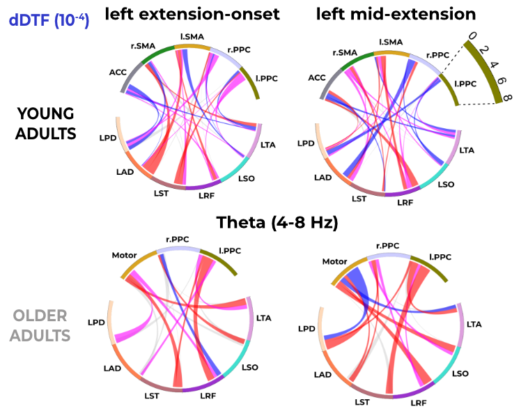
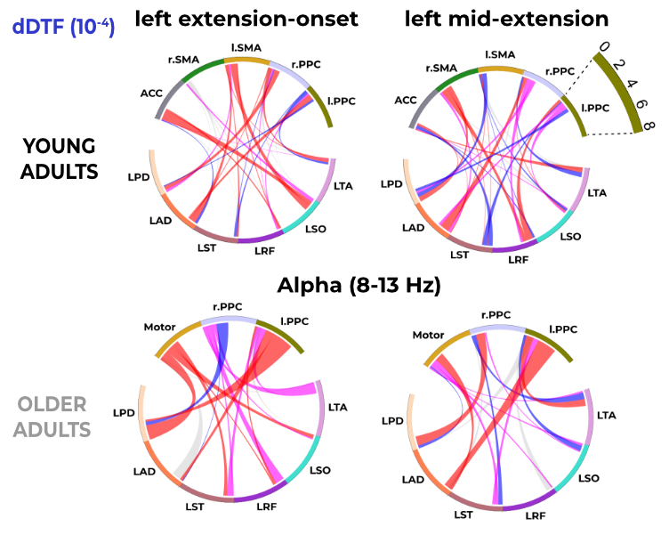
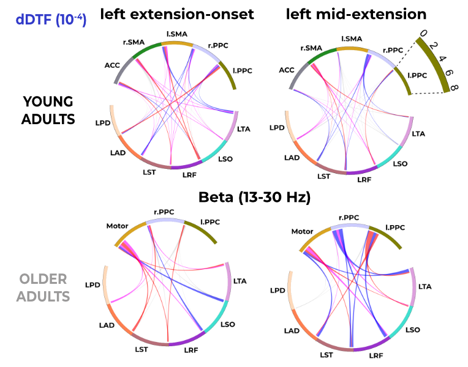

<!--- # Hypotheses and Key Observations

## Hypotheses
1. **Corticomuscular connectivity will increase between theta ACC and a subset of muscles.**
2. **Young adults will show increased connectivity between the motor cortex and all left-side muscles in response to stepping perturbations.**
3. **Older adults will show stronger connectivity to a subset of muscles from the motor cortex.**
4. **Older adults will show stronger connectivity to a subset of muscles from PPC.**
5. **Corticomuscular connectivity will be influenced by the timing of the perturbation.**

## Key Observations

- 
- 
- 

- **Hypothesis 1:**
  - Young adults exhibited significant connectivity between the anterior cingulate cortex (ACC) and a subset of lower and upper limb muscles, such as the soleus (LSO), rectus femoris (LRF), tibialis anterior (LTA), and posterior deltoid (LPD).
  - Older adults did not have an ACC cluster.

- **Hypothesis 2:**
  - Young adults demonstrated targeted connectivity between the motor cortex and all left-side muscles, including the rectus femoris (LRF), soleus (LSO), and anterior deltoid (LAD).
  - Connectivity patterns were more selective and task-specific in young adults.

- **Hypothesis 3:**
  - Older adults exhibited broader, compensatory connectivity patterns originating from the motor cortex to a subset of muscles, such as the LRF, LSO, and semitendinosus (LST).
  - These findings reflect compensatory cortical recruitment to maintain motor performance.

- **Hypothesis 4:**
  - Older adults showed stronger connectivity from the left posterior parietal cortex (PPC) to both upper- and lower-limb muscles, including the LAD and LSO.
  - This connectivity highlights the PPC’s role in sensorimotor integration and compensatory strategies.

- **Hypothesis 5:**
  - Perturbation timing significantly influenced connectivity:
    - Mid-extension perturbations elicited stronger connectivity in older adults, particularly from the motor cortex to the left posterior deltoid (LPD) and lower-limb muscles.
    - Young adults displayed more targeted connectivity during extension-onset perturbations, with strong motor-to-LPD connections.

--->
